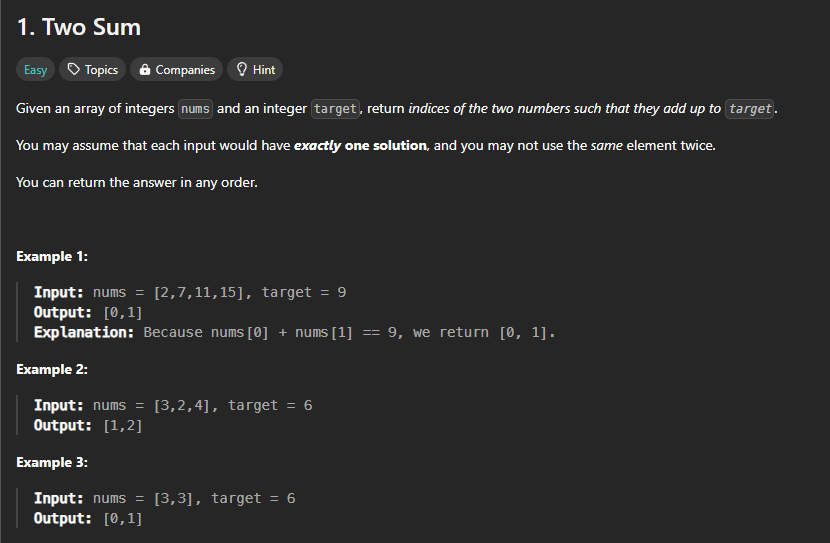

# 1. Two Sum

## Explanation of My Solution

Here's a step-by-step breakdown of how my solution works:

1. **Maintained a dictionary called `seen`**:

   - This dictionary keeps track of the numbers we have encountered so far and their corresponding indices.

2. **Iterated over `nums` using a `for` loop with `enumerate`**:

   - The use of `enumerate` allows us to loop through `nums` while also accessing the index `i` of each number, which is essential for building the result.

3. **Calculated the `complement`**:

   - We create a variable `complement` to represent the difference between `target` and the current number `num`. This is done to find out if there is a number in the list that can be added to `num` to reach the `target`.

4. **Checked if `complement` is in `seen`**:

   - If `complement` is already in `seen`, it means we have previously encountered the required number to sum with `num` and reach the `target`.
   - When this condition is met, we return the indices of the current number `i` and the stored index from `seen[complement]` as `[seen[complement], i]`.

5. **Updated `seen` with the current number and its index**:
   - If the `complement` is not found in `seen`, we store `num` and its index `i` in `seen` for future reference. This ensures that we continue to build a record of numbers and their indices as we iterate through the list.

### Example

Given `nums = [2, 7, 11, 15]` and `target = 9`:

- At the first iteration (`i = 0`, `num = 2`), `complement = 9 - 2 = 7`. `7` is not in `seen`, so we store `2` in `seen` as `{2: 0}`.
- At the second iteration (`i = 1`, `num = 7`), `complement = 9 - 7 = 2`. `2` is found in `seen`, so we return `[seen[2], 1]`, which is `[0, 1]`.

### Complexity Analysis

- **Time Complexity → O(n)**: We traverse the `nums` list once, making this a linear time complexity solution.
- **Space Complexity → O(n)**: The `seen` dictionary can store up to `n` elements, where `n` is the number of elements in `nums`.
